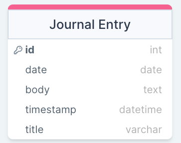
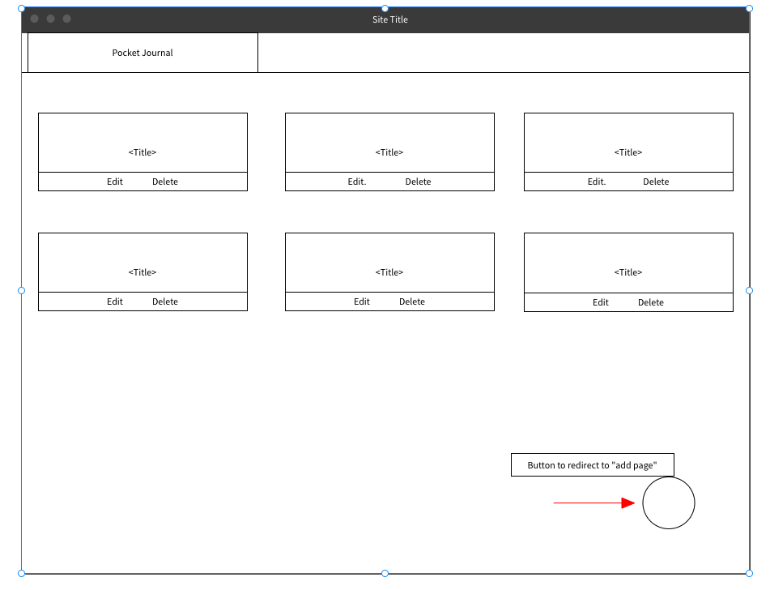
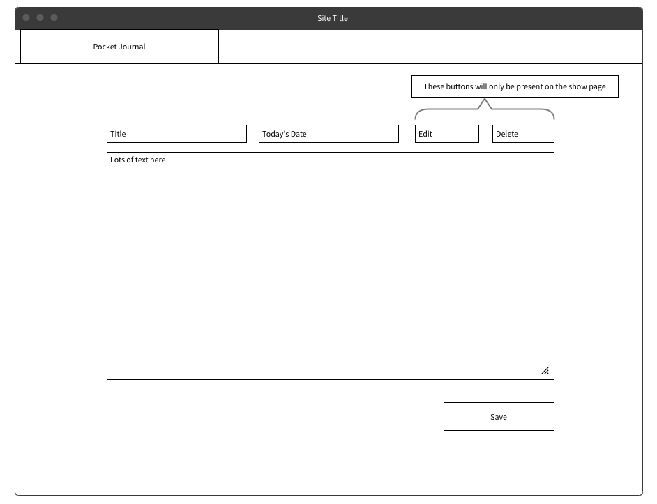

# Pocket Journal
---
### Description
This is a full CRUD application that will allow users to keep all their journaling in one place.
### Technologies Used
- Python
- Django
- PostSQL
- JavaScript/HTML/CSS
- Vue
- Tailwind
- Thunder Client
- DrawSQL
- Trello
- Render
- Netlify

### Routes & Components
- App --> Header 
- App --> Outlet 
- Outlet -- "/" --> Index
- Outlet -- "/entry/:id" --> Show
- Outlet -- "/entry/create" --> createAction
- Outlet -- "/entry/update/:id" --> updateAction
- Outlet -- "/entry/delete/:id" --> deleteAction

| Route | Method | Loader | Action | Function |
|-------|---------|--------|--------|----------|
| /entry| GET | Index | | Displays all journal entries|
| /entry/:id | GET | Show | | Returns a single journal entry by id |
| /entry | POST | | Create | Creates a new entry|
| /entry/:id | PUT | | Update | Updates an existing journal entry based on id |
| /entry/:id | DELETE | | Delete | Deletes a journal entry by id |

### Planning
[Trello](https://trello.com/invite/b/a6knKfwy/ATTI13924a143aa6ec7f6254036054926e38BEFFE97E/pocket-journal)
### Model

### Wireframe
Index Page

Show/New/Update Page
